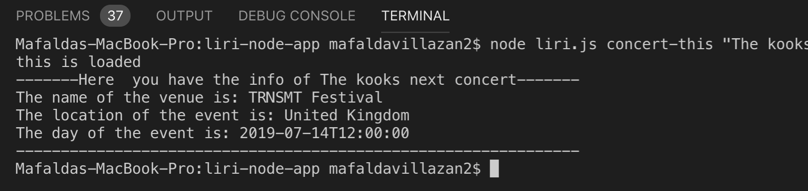
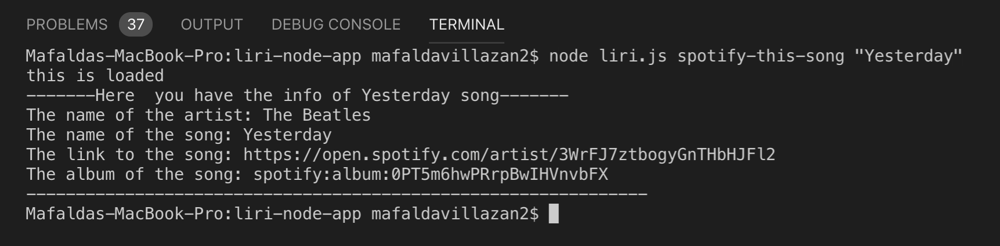
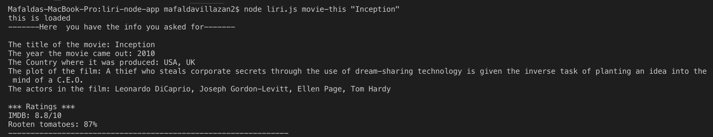
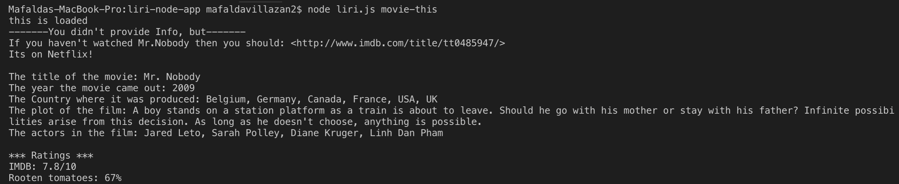
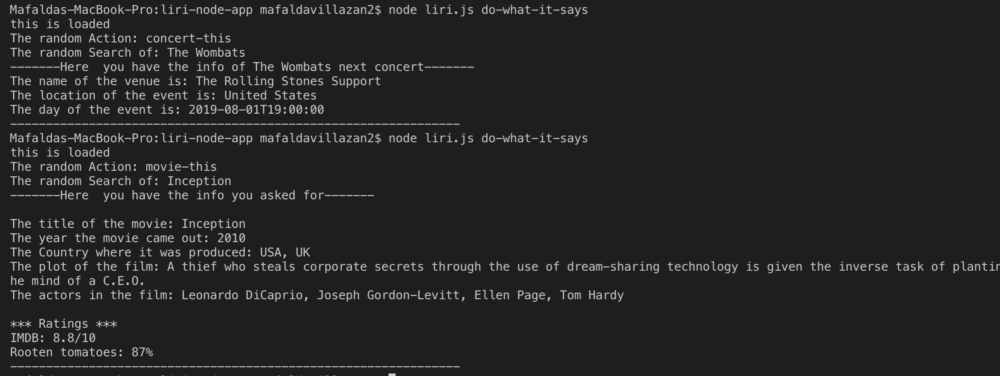

# liri-node-app
LIRI is a _Language_ Interpretation and Recognition Interface. LIRI will be a command line node app that takes in parameters and gives you back data.

Here are the commands you can write in the terminal and the results you can expect

*  `node liri.js concert-this <artist/band name here>`

* `node liri.js spotify-this-song '<song name here>'`

    * If the user input song
    

    * TO DEVELOP If the user  doesn't inputs
    

* `node liri.js movie-this '<movie name here>'`

    * If the user inputs movie
     

    * If the user  doesn't inputs
    

* `node liri.js do-what-it-says`
